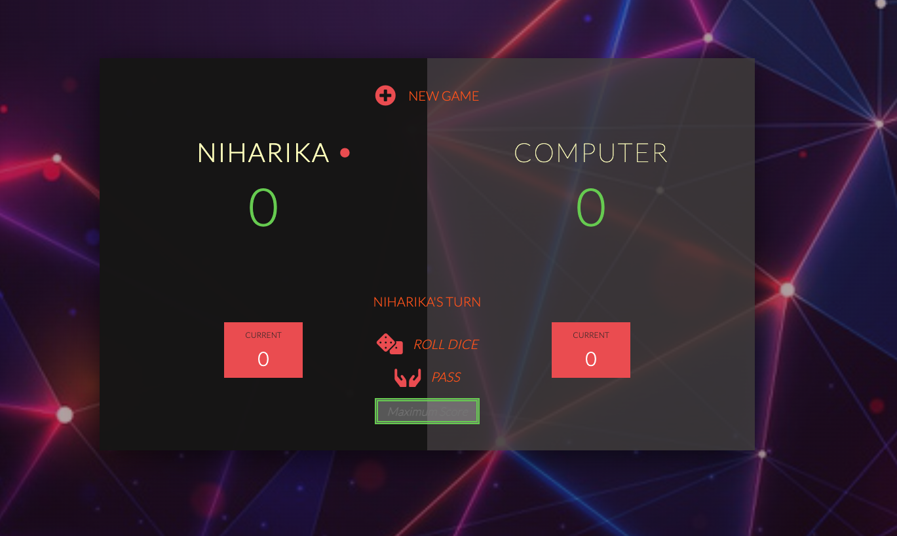
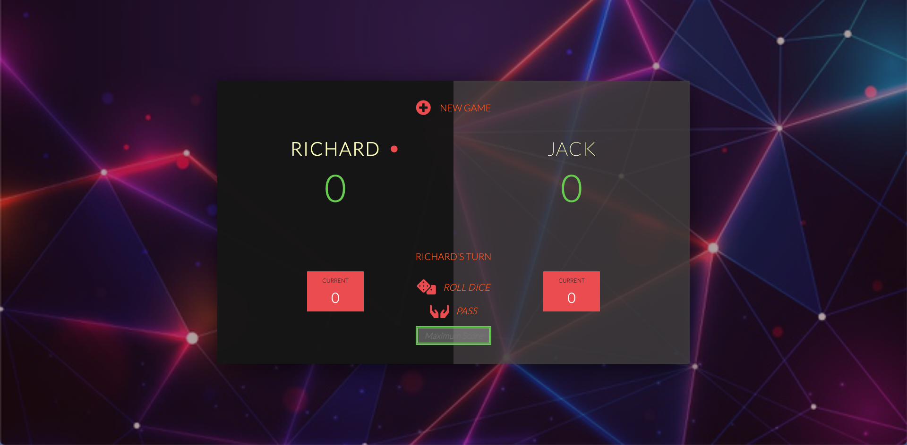
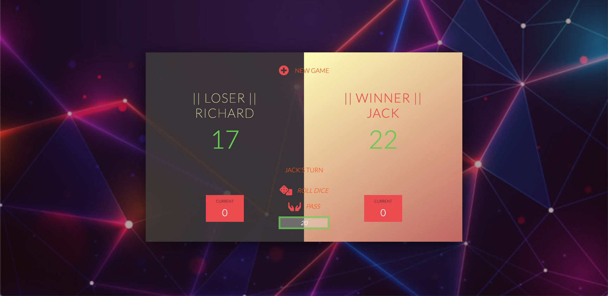

<h1 align="center"> Roll-A-Dice 🎲 </h1>
  

    <a href="https://niharika2k00.github.io/Dice-Game/"> <b> Live Site </b></a>    
  

<!-- TABLE OF CONTENTS -->

  
Table of Contents

  <ol>
    <li><a href="#about-the-project">About The Project</a></li>
    <li><a href="#dev-dependencies">Dev Dependencies</a></li>
    <li><a href="#contact">Contact</a></li>  </ol>

<!-- ABOUT THE PROJECT -->

## About The Project

A simple two player Dice-Game using HTML5, CSS3 & Javascript with a PWA implementation.

 

- #### Player vs Computer
  

- #### Player vs Player
    

- #### Final Result
    
   

## Dev Dependencies

- HTML5
- CSS
- Javascript

<!-- CONTACT -->

## Contact

Project Link: [https://github.com/niharika2k00/Dice-Game](https://github.com/niharika2k00/Dice-Game) 
LinkedIn - [Niharika Dutta](https://www.linkedin.com/in/niharika-dutta-ab40a11a6/) 
Twitter - [@niharika_2k](https://twitter.com/niharika_2k) 
